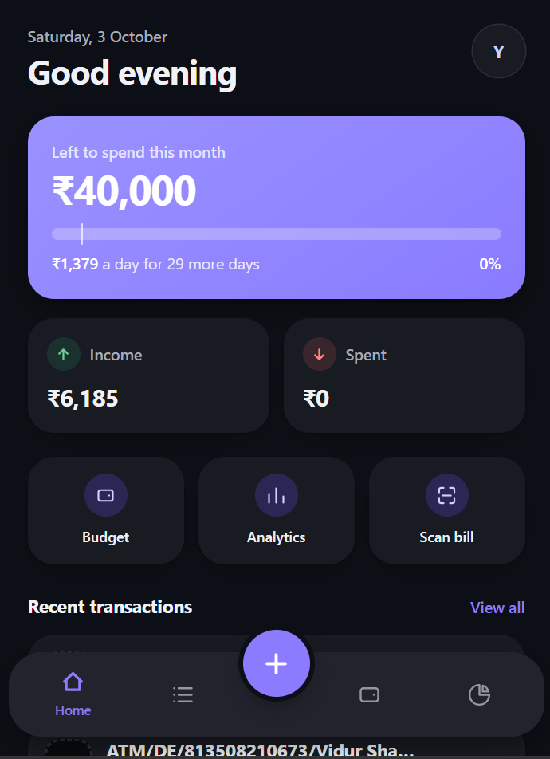
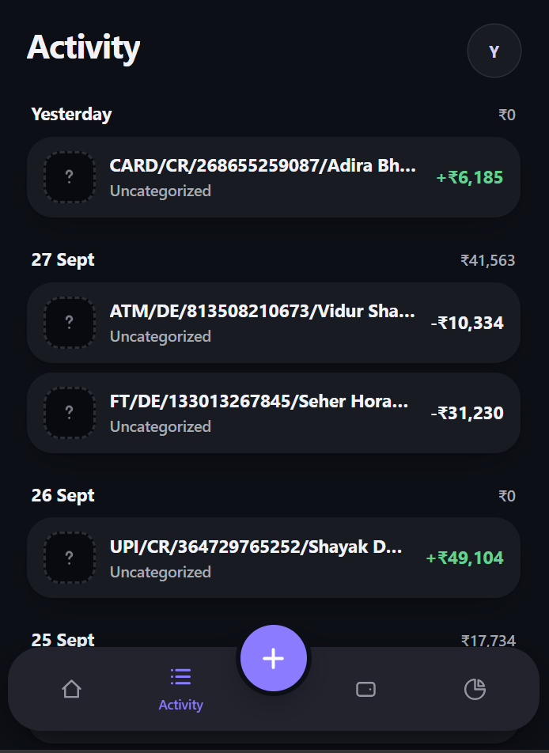
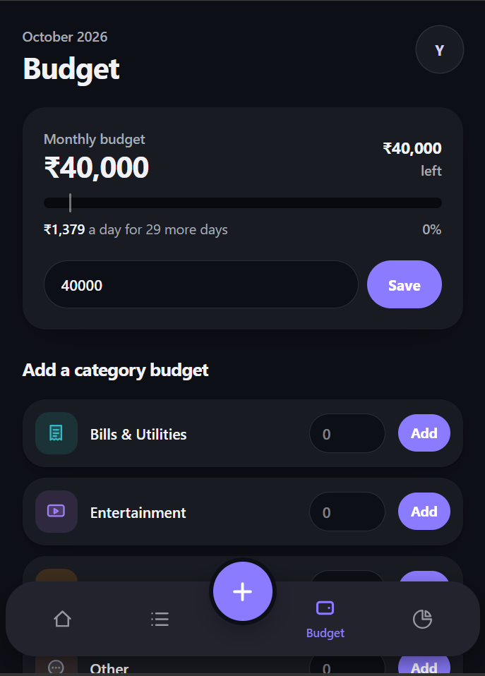
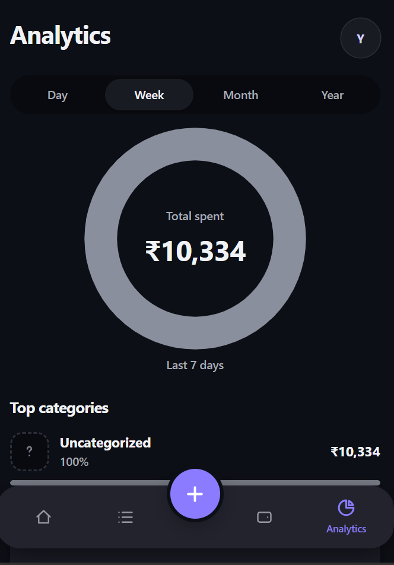
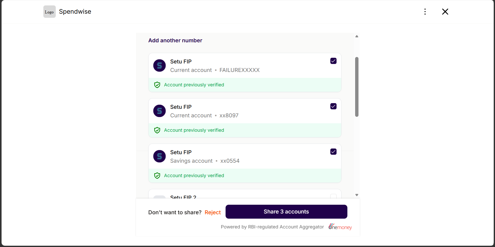

# SpendWise

**A personal finance app that imports your bank transactions automatically
through India's Account Aggregator network, sorts them into categories,
and shows where your money went.** You don't type anything in.

Built as a full-stack Next.js app with TypeScript, PostgreSQL and Prisma.
It is wired end to end against the
[Setu Account Aggregator](https://docs.setu.co/data/account-aggregator)
sandbox, and it ships a local mock of that gateway that sends realistic data.


<p align="center">
  
  
  
  
</p>
<p align="center"><sub>Home · Activity · Budget · Analytics. Transactions were imported from the Setu sandbox bank.</sub></p>

---

## What it does

- **Connect a bank account with consent instead of a password.** The user
  approves a consent request on the aggregator's own screens. SpendWise
  then pulls up to twelve months of statements on its own, so the user
  never shares bank credentials or uploads a CSV.
- **Categorize automatically.** Each imported transaction runs through a
  merchant-rules engine (Swiggy → Food, Uber → Transport, Netflix →
  Entertainment). If the user changes a category by hand, later syncs
  leave it alone.
- **Track budgets with pacing.** Each month has an overall budget and
  per-category budgets. A pace bar compares how much you've spent with how
  far through the month you are, so you see an overspend coming before it
  happens.
- **Show analytics.** Spending breaks down by category on a donut chart.
  You can switch the date range and compare this month with last month.
- **Record cash.** Cash spending that never reaches a bank can be added in
  a couple of taps from a bottom sheet.
- **Work on a phone.** The layout is built for mobile, with bottom-tab
  navigation.

## Engineering highlights

**A complete Account Aggregator integration.** Consent creation, the
approval redirect, account linking, data-session fetch and transaction
ingest all work against Setu's live sandbox. A webhook route also
handles consent and session updates server-to-server, so the import still
finishes if the user closes the tab. Webhooks are verified with HMAC
signatures and a constant-time comparison.

<p align="center">
  
</p>
<p align="center"><sub>The aggregator's consent screen. The user picks which accounts SpendWise may read, and SpendWise never sees bank credentials.</sub></p>

**Sync is idempotent and never overwrites a human.** Transactions are
upserted on a compound unique key (`linkedAccountId`, `externalId`), so
running a sync twice changes no rows. Each transaction records where its
category came from (`CategorySource`), so a category the user set by hand
always beats the automatic one.

**Parsers built for messy real-world data.** AA data is relayed from bank
XML, so the JSON has odd casing (`fipID`, `FIstatus`), a single
transaction arrives as a bare object instead of an array, and the
statement summary is sometimes missing. The parsers handle all three, and
the balance falls back to the latest transaction when the summary is
absent. Every case was confirmed against payloads the live sandbox
actually returned.

**A local mock gateway that behaves like the real one.**
[`scripts/mock-aa.ts`](./scripts/mock-aa.ts) serves the same `/v2` API
as Setu, so the app reaches it with one environment variable and no
special-case code. It can delay sessions, fail one bank so a session ends
`PARTIAL`, and send webhooks. Its statements come from a seeded random
generator, so the data is identical every run. That makes "sync twice and
the row count stays the same" a real test of the upsert.

**A categorization engine that avoids the obvious traps.** It is a pure
function with no dependencies, so it can be tested on its own:
- It matches whole words. A plain substring match would file *CHOCOLATE*
  under Transport because it contains *OLA*.
- Brand names are checked before generic keywords, so "Metro Card
  Recharge" counts as Transport and not Bills.
- Among matches of the same kind, the longer phrase wins: "Amazon Prime" →
  Entertainment, "Amazon" → Shopping.

**Graceful degradation.** Leave out the Setu credentials or the API keys
and the app still runs. Each affected page shows a clear "not configured"
state instead of crashing.

**Design decisions are written down.** [CONVENTIONS.md](./CONVENTIONS.md)
records the architecture decisions, why each dependency is pinned, the
auth and data-ownership rules, and what the first build taught. That
includes the two real bugs it shipped, a missing ownership check and a
percentage gap from uncategorized spend, and how to avoid both from the
start.

## Architecture

```
Browser ──► Next.js App Router (server components + server actions)
              │
              ├── /api/aa/consent ─┐
              ├── /api/aa/link     ├──► Setu AA gateway ──► Bank (FIP)
              ├── /api/aa/sync     │        (or local mock)
              └── /api/aa/webhook ◄┘   signed callbacks
              │
              ├── lib/setu.ts, setu-parse.ts   gateway client + tolerant parsers
              ├── lib/aa-ingest.ts             idempotent upsert + categorize
              ├── lib/categorize.ts            pure rules engine
              │
              └── Prisma ──► PostgreSQL (Supabase)
                     Supabase Auth (magic link) guards every route
```

| Step | Route | What happens |
|---|---|---|
| Consent | `POST /api/aa/consent` | Raises a consent with Setu and records which user it belongs to |
| Return from approval | `POST /api/aa/link` | Links each approved account and opens a data session |
| Fetch | `POST /api/aa/sync` | Pulls statements, then upserts and categorizes transactions |
| Out of band | `POST /api/aa/webhook` | Runs the same steps from Setu's signed notifications |

## Tech stack

| Layer | Technology |
|---|---|
| Framework | Next.js 16 (App Router, Server Components, Server Actions), React 19 |
| Language | TypeScript (strict) |
| Styling | Tailwind CSS v4, design tokens defined in CSS |
| Database | PostgreSQL on Supabase, Prisma ORM 6, migrations and seed scripts |
| Auth | Supabase Auth (passwordless magic link) |
| Bank data | Setu Account Aggregator API (sandbox), local mock gateway |
| Tooling | ESLint, `tsx` scripts for seeding, smoke tests and backfills |

## Project structure

```
src/
  app/
    (app)/            home, transactions, budget, analytics, more/*
    api/aa/           consent · link · sync · webhook
    connect-bank/     bank-linking flow
    login/, auth/     magic-link sign-in
  components/         UI: donut chart, budget pace bar, transaction list, sheets
  lib/                Setu client, parsers, ingest, categorization, queries
prisma/               schema, migrations, default + demo seed data
scripts/              mock AA gateway, Setu smoke test, dev sign-in, backfill
docs/SETUP.md         full setup and Setu sandbox walkthrough
```

## Running it locally

You need Node 20+ and a free [Supabase](https://supabase.com) project.

```bash
cp .env.example .env               # each variable says where to find its value
npm install
npx prisma migrate dev --name init
npm run db:seed                    # default categories
npm run dev
```

To try the bank-connect flow without Setu credentials, start the mock
gateway and set `SETU_AA_BASE_URL=http://localhost:4100`:

```bash
npm run mock:aa -- --webhook http://localhost:3000/api/aa/webhook
```

Open `/connect-bank`, enter any 10-digit number and approve. The app
links two accounts and imports about 470 categorized transactions.

**[docs/SETUP.md](./docs/SETUP.md)** has the full walkthrough: the Setu
sandbox, demo data, local sign-in without email limits, and every npm
script.

## Roadmap

- **Bill scanner.** Extract receipts with the Claude API. The data model
  and the screen exist; the upload flow does not yet.
- **LLM fallback for categorization.** Handle narrations that no rule
  matches.
- **Investments.** The ledger can only be edited by hand for now. It
  could sync from the AA's equity and mutual-fund data types.
- **Product analytics** with PostHog.
